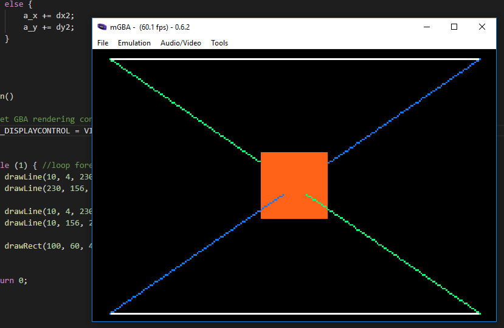

# 000_GBA_Hello_Pixel

This tutorial content comes from the tutoiral posted up [My First Pixels](https://jamiedstewart.github.io/gba%20dev/2019/02/16/GBA-Dev-My-First-Pixels.html) with the supporting YouTube video see here:

[](https://youtu.be/IfbZ9pYMZyQ)

A Simple Pixel plotter is created that allows for 16bit unsigned integer data to be written to the memory location of the *SCREENBUFFER* in one of the GBA's bitmap rendering modes. This pixel plotter covers line drawing and filling a rectangular area with a solid colour. The line plotting algorithm is taken from [Bresenham's Line Drawing Algorithm](https://en.wikipedia.org/wiki/Bresenham%27s_line_algorithm) on Wikipedia.  

Whilst there is some assumption that the person viewing this code has some idea of how to program in any programming language, so things like what is a variable are not covered explicitly. This tutorial does mention bit and byte sizes, but does not go into a great amount of deatial about these things just yet, this is planned for a later tutorial in the series.  

To get this project to build and run from the root directory, the following files in the **.vscode** directory will need to be modified. On the following lines:

**.c_cpp_properties.json**\
**Line 3 should read**: "proj_name":"000_Hello_Pixel"\

**launch.json**  
Line 7 : *"proj_name":"000_Hello_Pixel"* \
Line 20: *"program": "${workspaceFolder}/000_Hello_Pixel/000_Hello_Pixel.elf",*\

**tasks.json**
Lines 05 - 10 :\
```JSON
"options": {
        "env": {
          "proj_working_dir": "PWD=000_Hello_Pixel",
          "proj_name":"000_Hello_Pixel"
        }
     },
```

 **Only need to modify if you are using PC** \
Line 71: *"command": "**path_to_mGBA**/mGBA.exe -g ${workspaceFolder}/$env:proj_name/$env:proj_name.gba;sleep 5;echo debuggerReady"* \
Line 90: *"command": "**path_to_mGBA**/mGBA-0.6.3-win32/mGBA.exe ${cwd}/$env:proj_name/$env:proj_name.gba"* \
**Only need to modify if you are using OS X** \
Line 74 & 93: *"command": "**path_to_mGBA**/mGBA.app/Contents/MacOS/mGBA",* \


