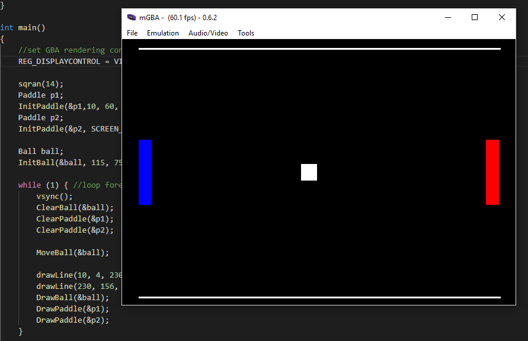

# 001_GBA_Hello_Pong

This tutorial content comes from the tutoiral posted up [My First Pixels](https://jamiedstewart.github.io/gba%20dev/2019/02/16/GBA-Dev-My-First-Pixels.html) with the supporting YouTube video see here:

This program introduces some of the code that goes into creating a game like Pong. How to read the IO registers for button input on the GBA is not covered in this tutorial, this tutorial covers the creation of a simple scene from the game of Pong up to the point that user input would be required to take the implementation further. This tutorial is an extention on the first tutorial which saw us creating some standard drawing routines to enable drawing of lines and boxes to the screen, if you felt like challenging yourself then you may have completed the further exercise for that tutorial to draw arcs and circles using Bresenham's Circle Drawing algorithm.

Whilst there is some assumption that the person viewing this code has some idea of how to program in any programming language, so things like what is a variable are not covered explicitly, the basics of what constitutes a **struct** in **C Programming Language** are covered. This tutorial does mention bit and byte sizes, but does not go into a great amount of deatial about these things just yet, this is planned for a later tutorial in the series.

This project creates the basic set up for the game of pong and introduces some basic collision code to keep an object inside of some boundary. In this instance the object will be the ball and the boundary will be the screen. This tutorial additionally introduces the concept of the **vBlank** to ensure that we only draw our frame when a draw cycle for the content of the screen has finished to avoid any screen tearing.  

To get this project to build and run from the root directory, the following files in the **.vscode** directory will need to be modified. On the following lines:

**.c_cpp_properties.json**\
**On OS X modify**: Lines 8, 16\
**On Linux modify**: Lines 31, 39\
**On PC modify**: Lines 52, 69\
All lines should have the following text:  *"${workspaceFolder}/001_Hello_Pong/include"*  

**launch.json**  
Line 16 : *"program": "${workspaceFolder}/001_Hello_Pong/001_Hello_Pong.elf",* \
**Only need to modify this line if you are using PC** \
Line 27 : *"text": "file **path_to_root_directory**/001_Hello_Pong/001_Hello_Pong.elf -enable-pretty-printing"* \
**Only need to modify this line if you are using OS X** \
Line 36 : *"text": "file **path_to_root_directory**/001_Hello_Pong/001_Hello_Pong.elf -enable-pretty-printing"* \

**tasks.json**
Line 06 : *"cwd":"${workspaceFolder}/001_Hello_Pong"* \
 **Only need to modify if you are using PC** \
Line 54 & 76 : *"command": "**path_to_mGBA**/mGBA.exe -g ${workspaceFolder}/001_Hello_Pixel/001_Hello_Pong.gba;sleep 5;echo debuggerReady"* \
*line 76 does not need from ";sleep..." onwards.* \
**Only need to modify if you are using OS X** \
Line 60 & 81: *"${workspaceFolder}/001_Hello_Pong/001_Hello_Pong.gba"* \

