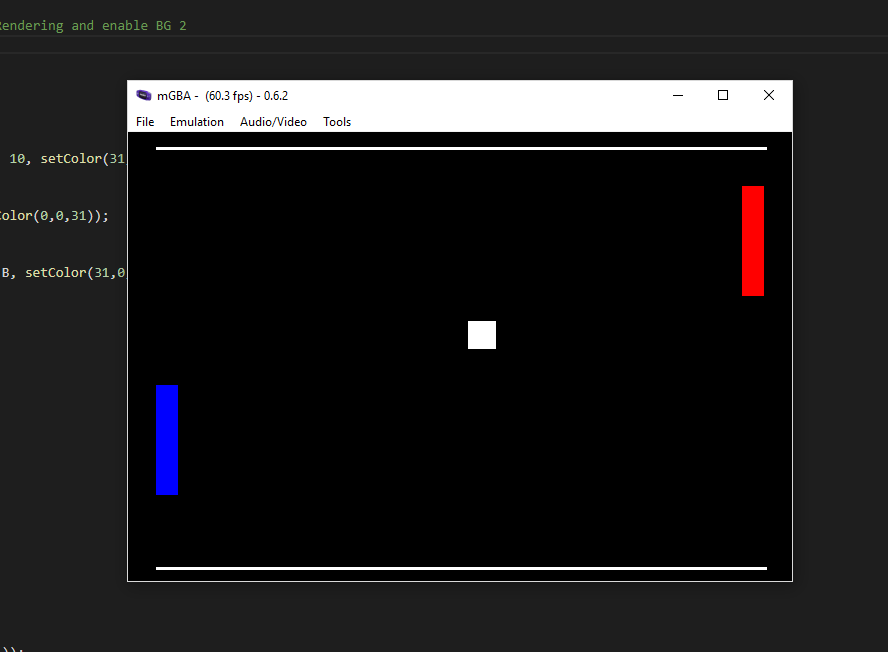

# 002_GBA_Hello_Input

This tutorial content comes from the tutoiral posted up [GBA Button Input](https://jamiedstewart.github.io/gba%20dev/2019/02/16/GBA-Dev-My-First-Pixels.html) with the supporting YouTube video see here:

[](https://www.youtube.com/embed/Rj0lf46iljc)

This program continiues the process of creating a game like Pong. The previous tutorial in this series saw us creating a simple version of Pong that had a moving ball and two static paddles, continuing this code we will first break the project down into separate header and source files as working on something in one massive C file and having all game logic contained within main.c is not a great way of making a game.  

This tutorial additionally introduces how to handle the volatile data that cn be found in the input registers for the button presses on the GBA. Here we read from an input register and then use bitwise operations to test this register to see which key has been pressed. We will code additonal logic to calculte if a button has been pressed or released in the current frame or if it is being held down between subsequent update frames.

To get this project to build and run from the root directory, the following files in the **.vscode** directory will need to be modified. On the following lines:

**.c_cpp_properties.json**\
**Line 3 should read**: "proj_name":"002_Hello_Input"\

**launch.json**  
Line 7 : *"proj_name":"002_Hello_Input"* \
Line 20: *"program": "${workspaceFolder}/002_Hello_Input/002_Hello_Input.elf",*\

**tasks.json**
Lines 05 - 10 :\

```JSON
"options": {
        "env": {
          "proj_working_dir": "PWD=002_Hello_Input",
          "proj_name":"002_Hello_Input"
        }
     },
```

 **Only need to modify if you are using PC** \
Line 71: *"command": "**path_to_mGBA**/mGBA.exe -g ${workspaceFolder}/$env:proj_name/$env:proj_name.gba;sleep 5;echo debuggerReady"* \
Line 90: *"command": "**path_to_mGBA**/mGBA-0.6.3-win32/mGBA.exe ${cwd}/$env:proj_name/$env:proj_name.gba"* \
**Only need to modify if you are using OS X** \
Line 74 & 93: *"command": "**path_to_mGBA**/mGBA.app/Contents/MacOS/mGBA",* \


