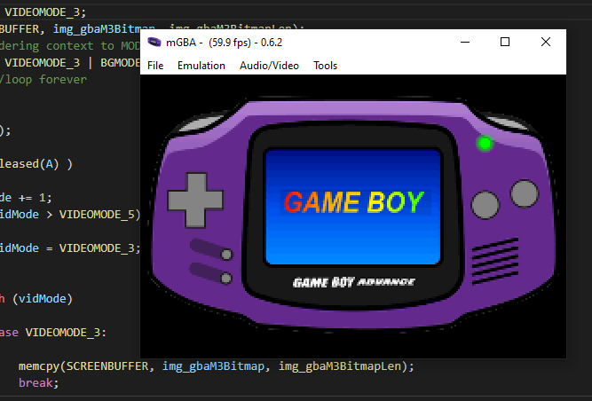

# 004_Bitmap_Loading

This tutorial content comes from the tutoiral posted up [GBA Bitmap Loading](https://jamiedstewart.github.io/gba%20dev/2019/02/16/GBA-Dev-My-First-Pixels.html) with the supporting YouTube video see here:

[](https://www.youtube.com/embed/Rj0lf46iljc)

This program continues the exploration of creating games for the Game boy Advance, this specific tutorial looks at loading bitmap image data into VRAM and displaying it on the screen. This tutorial demonstrates the different pixel modes for the different rendering modes, finally using different rendering modes than the previous tutorials which were limited to mode 3 rendering only.

To get this project to build and run from the root directory, the following files in the **.vscode** directory will need to be modified. On the following lines:

**.c_cpp_properties.json**\
**Line 3 should read**: "proj_name":"004_Bitmap_Loading"\

**launch.json**  
Line 7 : *"proj_name":"004_Bitmap_Loading"* \
Line 20: *"program": "${workspaceFolder}/004_Bitmap_Loading/004_Bitmap_Loading.elf",*\

**tasks.json**
Lines 05 - 10 :\

```JSON
"options": {
        "env": {
          "proj_working_dir": "PWD=004_Bitmap_Loading",
          "proj_name":"004_Bitmap_Loading"
        }
     },
```


