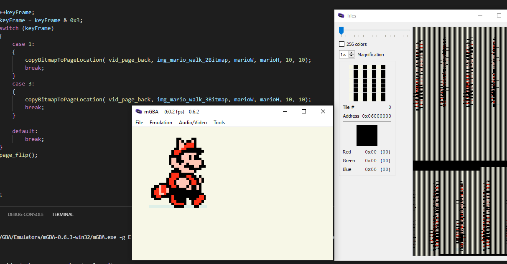

# 005_Mode4_Bitmap_Rendering

This tutorial content comes from the tutoiral posted up [GBA Bitmap Loading](https://jamiedstewart.github.io/gba%20dev/2019/02/16/GBA-Dev-My-First-Pixels.html) with the supporting YouTube video see here:

[](https://www.youtube.com/embed/Rj0lf46iljc)

This program continues the exploration of creating games for the Game boy Advance, this specific tutorial looks at making use of page flipping available in bitmap rendering mode 4 on GBA hardware. The GBA hardware in rendering mode 4 allows for a front and back render buffer target.

This tutorial demonstrates page swapping with mode4 rendering mode as this render mode has a front and back buffer that can be drawn to and control of which buffer is drawn to the screen is controlled by the programmer.

To get this project to build and run from the root directory, the following files in the **.vscode** directory will need to be modified. On the following lines:

**.c_cpp_properties.json**\
**Line 3 should read**: "proj_name":"005_Mode4_Bitmap_Rendering"\

**launch.json**  
Line 7 : *"proj_name":"005_Mode4_Bitmap_Rendering"* \
Line 20: *"program": "${workspaceFolder}/005_Mode4_Bitmap_Rendering/005_Mode4_Bitmap_Rendering.elf",*\

**tasks.json**
Lines 05 - 10 :\

```JSON
"options": {
        "env": {
          "proj_working_dir": "PWD=005_Mode4_Bitmap_Rendering",
          "proj_name":"005_Mode4_Bitmap_Rendering"
        }
     },
```


