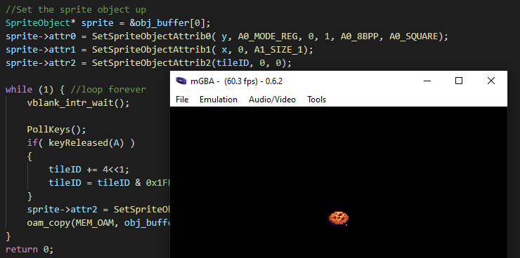

# 006_Sprites_Introduction

This tutorial content comes from the tutoiral posted up [GBA Bitmap Loading](https://jamiedstewart.github.io/gba%20dev/2019/02/16/GBA-Dev-My-First-Pixels.html) with the supporting YouTube video see here:

[](https://www.youtube.com/embed/Rj0lf46iljc)

This tutorial introduces hardware sprites on the GBA and making use of Object Attribute Memory. The GBA supports 128 hardware sprites, sprites can have various dimensions from 8x8 pixels up to a maximum of 64x64 pixels. All individual sprite data is controlled via three attribute values, sprites may additionally be defiened as being affine which allows spites to be rotated and scaled, this tutorial will not cover affine sprites these will be covered when fixed point maths are introduced in a later tutorial.

This tutorial demonstrates loading sprites of different sizes, and how these sprites can be positioned and moved around the screen. This tutorial will look at sprite palette swapping, as was used in older games to provided colour differences between player 1 and player 2 sprites without needing to load in additional sprite tile data. 

To get this project to build and run from the root directory, the following files in the **.vscode** directory will need to be modified. On the following lines:

The food sprite sheet that is used for this tutorial comes from Henry Software and is available for free from [itch.io](https://henrysoftware.itch.io/pixel-food) free sprites

**.c_cpp_properties.json**\
**Line 3 should read**: "proj_name":"006_Sprites_Introduction"\

**launch.json**  
Line 7 : *"proj_name":"006_Sprites_Introduction"* \
Line 20: *"program": "${workspaceFolder}/006_Sprites_Introduction/006_Sprites_Introduction.elf",*\

**tasks.json**
Lines 05 - 10 :\

```JSON
"options": {
        "env": {
          "proj_working_dir": "PWD=006_Sprites_Introduction",
          "proj_name":"006_Sprites_Introduction"
        }
     },
```


